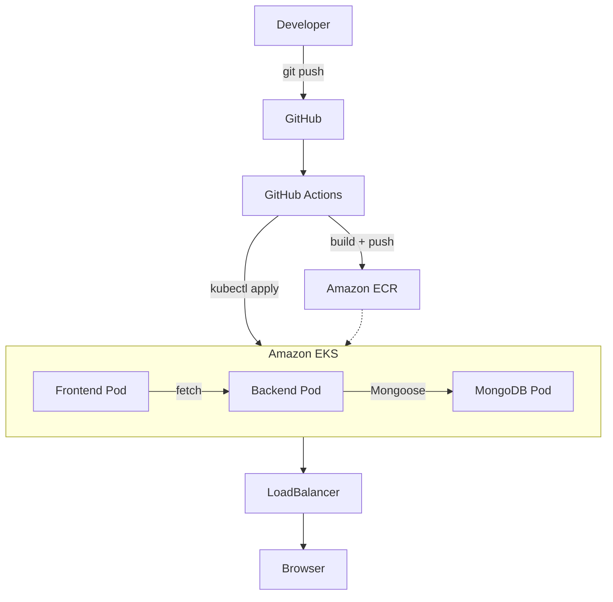

# Todo App — AWS DevOps CI/CD Pipeline

A full-stack Todo app (HTML/CSS/JS frontend, Node.js/Express backend, MongoDB) that's containerized with Docker, deployed on Amazon EKS, and auto-deployed via GitHub Actions CI/CD.

## Aim

Demonstrate a complete, automated deployment pipeline — from `git push` to a live app on AWS — with zero manual deployment steps.

## Objectives

- Build a working full-stack Todo app across three tiers (frontend, backend, database)
- Containerize each service independently with Docker
- Store images in Amazon ECR and deploy them to Amazon EKS
- Automate build → push → deploy with GitHub Actions on every push to `main`
- Give MongoDB persistent storage that survives pod restarts
- Use least-privilege IAM: a restricted CI/CD identity, separate from an admin identity for setup

## Tech Stack

| Layer | Technology |
|---|---|
| Frontend | HTML, CSS, JavaScript (single static file, no build step) |
| Backend | Node.js, Express |
| Database | MongoDB |
| Containers | Docker |
| Registry | Amazon ECR |
| Orchestration | Amazon EKS (Kubernetes) |
| CI/CD | GitHub Actions |
| Networking | Kubernetes LoadBalancer (AWS ELB) |
| Storage | Amazon EBS via `aws-ebs-csi-driver` |

## Project Structure

```
todo-app/
├── backend/            # Express API (app.js, Dockerfile)
├── frontend/           # index.html (all HTML/CSS/JS), Dockerfile
├── k8s/                # mongo.yaml, backend.yaml, frontend.yaml, storageclass.yaml
├── .github/workflows/  # deploy.yml — CI/CD pipeline
└── README.md
```

## Architecture



Frontend calls the backend's REST API → backend reads/writes MongoDB → GitHub Actions rebuilds and redeploys all of this automatically on every push.

## How to Run

**Local:**
```bash
cd backend && cp .env.example .env && npm install && npm start   # :5000
cd frontend && python3 -m http.server 3000                       # :3000
```

**Deploy to AWS:**
```bash
aws ecr create-repository --repository-name todo_backend --region us-east-1
aws ecr create-repository --repository-name todo_frontend --region us-east-1

eksctl create cluster --name todo-cluster --region us-east-1 --nodes 2 --node-type t3.small

# Install EBS CSI driver (needed for MongoDB's persistent volume)
eksctl utils associate-iam-oidc-provider --cluster todo-cluster --region us-east-1 --approve
eksctl create addon --cluster todo-cluster --name aws-ebs-csi-driver --region us-east-1 --force

kubectl create secret generic backend-secrets \
  --from-literal=PORT=5000 --from-literal=MONGO_URI=mongodb://mongo-service:27017/tododb

kubectl apply -f k8s/storageclass.yaml
kubectl apply -f k8s/mongo.yaml
kubectl apply -f k8s/backend.yaml
kubectl apply -f k8s/frontend.yaml

kubectl get svc frontend-service   # EXTERNAL-IP = your live app
```

**Enable CI/CD:** add `AWS_ACCESS_KEY_ID` and `AWS_SECRET_ACCESS_KEY` (for a restricted `github-actions-deployer` IAM user) as GitHub repo secrets. Every push to `main` now auto-deploys.

**Cleanup:**
```bash
kubectl delete -f k8s/frontend.yaml
eksctl delete cluster --name todo-cluster --region us-east-1
aws ecr delete-repository --repository-name todo_backend --force
aws ecr delete-repository --repository-name todo_frontend --force
```

## IAM Setup

Two identities, kept separate:
- **Admin user** — one-time setup only (create cluster, install CSI driver, grant access)
- **`github-actions-deployer`** — CI/CD only: ECR push/pull + an EKS **Access Entry** (`AmazonEKSClusterAdminPolicy`). IAM permissions alone aren't enough for `kubectl` — EKS access entries are a separate layer.

## Troubleshooting

| Issue | Fix |
|---|---|
| `./backend not found` in CI | Repo files must sit at root, not nested in a subfolder |
| `repository does not exist` on push | ECR repo name must exactly match `deploy.yml`'s env vars |
| `AccessDeniedException` on EKS calls | Wrong IAM identity active — check with `aws sts get-caller-identity` |
| `kubectl apply` fails after `update-kubeconfig` succeeds | Missing EKS Access Entry for that IAM identity |
| MongoDB PVC stuck `Pending` | Install the `aws-ebs-csi-driver` addon |
| Backend `CreateContainerConfigError` | `backend-secrets` Secret not created yet |

## Conclusion

This project replaces manual, error-prone deployment with a single automated pipeline: one `git push` builds fresh images, pushes them to ECR, and rolls them out to EKS — no manual steps, and CI/CD credentials scoped to only what they need.

**Future improvements:** automated tests in CI, Infrastructure as Code (Terraform), OIDC-based CI/CD auth instead of static keys, HPA autoscaling, HTTPS via ACM + ALB Ingress, managed MongoDB Atlas.
